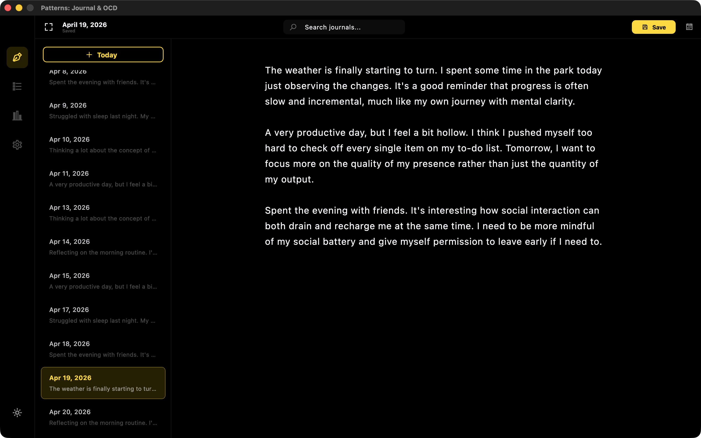
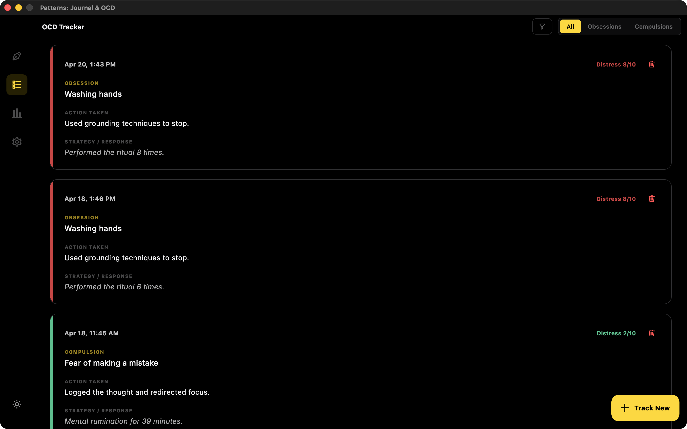

  

<h1 align="center">Patterns</h1>

  <strong>Clarity for the mind through structured reflection.</strong>

  
  
  

Patterns is a focused journaling and OCD self-tracking app for daily reflection. It gives you a private local space to record journal entries, obsessive or compulsive events, distress levels, response strategies, and trends over time.

Patterns is for personal reflection and self-tracking. It does not diagnose, treat, prevent, or cure any condition, and it is not a replacement for care from a qualified clinician.

## Screenshots

  

  

## What Patterns Does

The application is built around two core activities:

**Daily Journaling**
A minimalist writing space where you can record your thoughts and experiences. Each entry is tied to a specific date, allowing you to build a chronological history of your mental well-being.

**OCD Tracking**
Dedicated tools to document obsessions and compulsions as they happen. You can record the nature of the thought or urge, the actions taken in response, and the associated distress levels on a 0 to 10 scale.

## How to Use Patterns

**Navigation**
Use the sidebar to switch between your Journal and the OCD Tracker. You can also toggle between light and dark modes at the bottom of the navigation bar to suit your environment.

**Journaling**
Select a date from the calendar or use the "New Entry Today" shortcut. Write your thoughts in the main editor and use the Save button to persist your entry. You can browse previous entries by selecting them from the list on the left.

**Tracking Events**
When an obsession or compulsion occurs, use the "Track New" button. Choose the event type, describe what happened, and set your distress level. These entries are saved in a structured list for easy review.

## Privacy and Data

Patterns is local-first. Journal entries, OCD events, distress ratings, strategy notes, and app preferences stay on your device. The app does not create an account, upload user entries to a server, sell data, or share data with third parties.

You can delete individual entries or wipe local app data from Settings. Manual export creates a readable, unencrypted JSON backup file in the location you choose, so exported files should be stored somewhere private.

## Community

We’d love to have you as part of our community! 

- **[GitHub Discussions](https://github.com/maskedsyntax/patterns/discussions):** Ask questions, share ideas, and connect with other users.
- **[Issues](https://github.com/maskedsyntax/patterns/issues):** Report bugs or request technical improvements.

Please remember to be kind and respectful to others in our community.
